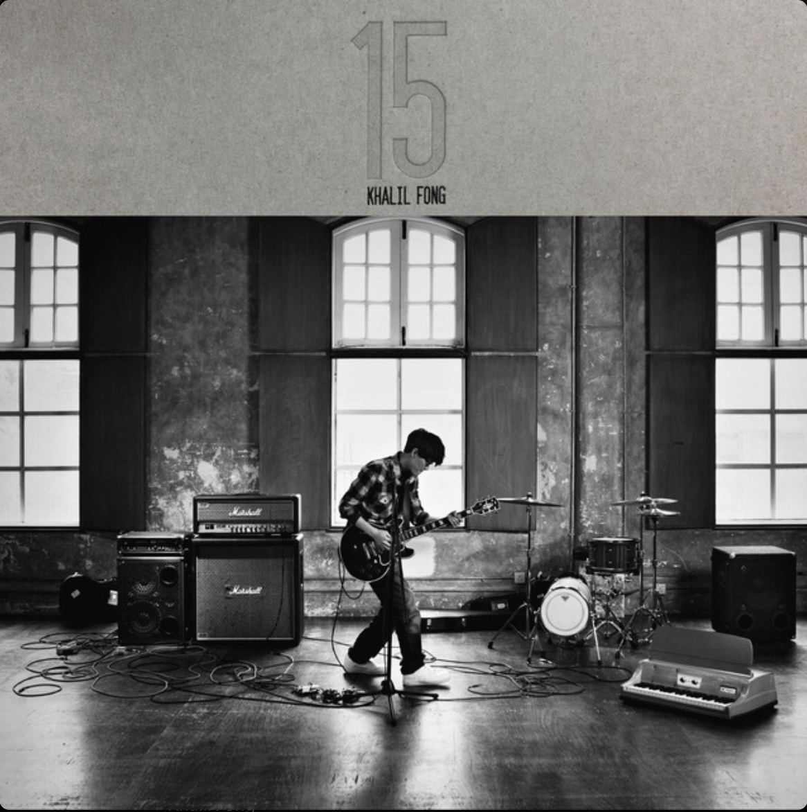

## Yisong Miao's Academic Homepage

<!--  -->

# About {#about}

Aloha 👋 You have reached my academic homepage. 

I am a fifth year PhD student at [WING](https://wing.comp.nus.edu.sg/)-[SoC](https://comp.nus.edu.sg/)-[NUS](https://nus.edu.sg/). I study natural language processing with [Prof. Min-Yen Kan](https://www.comp.nus.edu.sg/~kanmy). 

**Physical Yisong:** AS6 Building, meet me in the lab :P  **Digital Yisong:** [[Google Scholar](
https://scholar.google.com/citations?hl=en&user=a-oIKBoAAAAJ&view_op=list_works&sortby=pubdate)]  [[LinkedIn](https://www.linkedin.com/in/yisongmiao/)]  [[GitHub](https://github.com/YisongMiao/)] [[Twitter](https://twitter.com/yisongmiao)]  [[Skype](live:miaoyisong)]  **Email Yisong:** [yisong domain-of comp.nus.edu.sg]; [miaoyisong domain-of gmail.com]. 

🍁🍃🌴 Summer 2025: I am excited to visit [Prof. Vered Shwartz](https://www.cs.ubc.ca/~vshwartz/) at [UBC NLP](https://nlp.cs.ubc.ca) and [the Vector Institute](https://vectorinstitute.ai) for an exciting project about pragmatics. 

# Research {#papers}
## Overview

I ❤️ 🆑. 

I study how language models interpret meanings, relationships, and structures in linguistic elements like discourse and emojis. 
My work involves developing new datasets, evaluation methods, and inference algorithms to advance understanding.

See also [my homepage at our group](https://wing.comp.nus.edu.sg/author/yisong-miao/). 

## Papers
I only list my **🔝 3️⃣ 📜** here ([Complete list](publications) is also available):

[📜1] <i><u>Discursive Circuits: How Do Language Models Understand Discourse Relations?</u></i>  
Yisong Miao, Min-Yen Kan  
**EMNLP 2025 (talk)**  
PDF and codebase to come. 

[📜2] <i><u>Discursive Socratic Questioning: Evaluating the Faithfulness of Language Models’ Understanding of Discourse Relations.</u></i> 
Yisong Miao, Hongfu Liu, Wenqiang Lei, Nancy F. Chen, Min-Yen Kan  
**ACL 2024 (talk)** ⭐️[Senior Area Chair Award (Discourse and Pragmatics Track)](https://2024.aclweb.org/program/best_papers/#sac-awards)⭐️  
[[PDF](https://yisong.me/publications/acl24-DiSQ-CR.pdf)] [[Slides](https://yisong.me/publications/acl24-DiSQ-Slides.pdf)] [[Poster](https://yisong.me/publications/acl24-DiSQ-Poster.pdf)] [[Data and Code](https://github.com/YisongMiao/DiSQ-Score)]  

[📜3] <i><u>The ELCo Dataset: Bridging Emoji and Lexical Composition.</u></i>  
Zi Yun Yang, Ziqing Zhang, Yisong Miao (2024).  
**LREC-COLING 2024 (poster)**  
[[PDF](https://yisong.me/publications/ELCo@LREC-COLING24.pdf)] [[Slides](https://yisong.me/publications/ELCo@LREC-COLING24-Oral.pdf)] [[Poster](https://yisong.me/publications/ELCo-Poster.pdf)] [[Data and Code](https://github.com/WING-NUS/ELCo)]  

# More information {#mi}
## Favorites
My favorite singer is [Khalil Fong](https://khalilfong.com/2017/#3). His 2011 album *[15](https://open.spotify.com/album/01mDyY0OcuqHnvTbEKBH0s)* is my favorite.  
**March 1, 2025:** Like all of Kahlil’s listeners, I’m heartbroken to hear that he's not with us anymore. However, his music will be forever played. 🏝️🏝️🏝️
<!-- **March 1, 2025:** Thank you, Kahlil. 🏝️🏝️🏝️ -->
 My favorite composer is [Frédéric Chopin](https://youtu.be/UcOjKXIR8Iw?si=a60Lmo8h_NIYPAxS). I especially enjoy his [Piano Concerto No. 1](https://youtu.be/gV_x_QY1P5c?si=W4ledRy-fA_662Hu) and his [Nocturne No. 8 In D Flat, Op. 27 No. 2](https://youtu.be/vDaeVGAzgqo?si=ChjU8mvFVEFik3Xw).  My favorite driver is [Charles Leclerc](https://youtu.be/h-ce3gPMsGc?si=JC0MY-DFGm3AKzXw). He won in [Austin '24](https://youtu.be/kLCytMTycxI?si=8YLPqrirZJtg8Bf2), [Monza '24](https://www.youtube.com/watch?v=sTmpbEYUba0&pp=ygURZjEgaXRhbHkgbW9uemEgMjQ%3D), [Monte Carlo '24](https://www.youtube.com/watch?v=aeCI0ObFY8M&pp=ygUMZjEgbW9uYWNvIDI0), [Red Bull Ring '22](https://www.youtube.com/watch?v=G_8mOQeSa2U&pp=ygUPZjEgYXVzdHJpYSAyMDIy), [Albert Park '22](https://www.youtube.com/watch?v=dt8ANZIZ8Co&pp=ygURZjEgYXVzdHJhbGlhIDIwMjI%3D), [Bahrain '22](https://www.youtube.com/watch?v=wIYPuzWCCSw&pp=ygUPZjEgYmFocmFpbiAyMDIy), [Monza '19](https://www.youtube.com/watch?v=h-ce3gPMsGc&t=26s&pp=ygUNZjEgaXRhbHkgMjAxOQ%3D%3D), and [Spa '19](https://www.youtube.com/watch?v=dnnh8unDP4Y&t=182s&pp=ygUPZjEgYmVsZ2l1bSAyMDIy). 

## Readings
Recent readings:
- *[Leonardo da Vinci](https://www.goodreads.com/book/show/34684622-leonardo-da-vinci)* by Walter Isaacson, 2017.
- *[Educated](https://www.goodreads.com/book/show/35133922-educated)* by Tara Westover, 2018.
- *[Logics in Conversation](https://www.goodreads.com/book/show/3278042-logics-of-conversation)* by Nicholas Asher and Alex Lascarides, 2003. 
- *[A History of Western Philosophy](https://www.goodreads.com/book/show/243685.A_History_of_Western_Philosophy)* by Bertrand Russell, 1945.

All time favorites:
- *[The Three-Body Problem: The Dark Forest](https://www.goodreads.com/book/show/23168817-the-dark-forest)* by Cixin Liu, 2008. 
- *[Harry Potter and the Prisoner of Azkaban](https://www.goodreads.com/book/show/5.Harry_Potter_and_the_Prisoner_of_Azkaban)* by J.K. Rowling, 1999. 
- *[Three Hundred Song Lyrics](https://en.wikipedia.org/wiki/Ci_(poetry))* available at [Wiki](https://zh.wikisource.org/zh/宋詞三百首), 10th to 13th centuries.

## Calendar {#calendar}
My [Google Calendar](#calendar) is here. Carpe Diem! 

<dev>

<iframe src="https://calendar.google.com/calendar/embed?height=600&amp;wkst=1&amp;bgcolor=%23ffffff&amp;ctz=Asia%2FManila&amp;src=ZTNvcTIwbXBqYzMyMDc4OG1zajNpZm84M3NAZ3JvdXAuY2FsZW5kYXIuZ29vZ2xlLmNvbQ&amp;color=%23039BE5" style="border:solid 1px #777" width="800" height="600" frameborder="0" scrolling="no"></iframe>

</dev>

[🔝 Go back to top](#about)

<i>------ Stay Hungry, Stay Foolish ------</i>   

